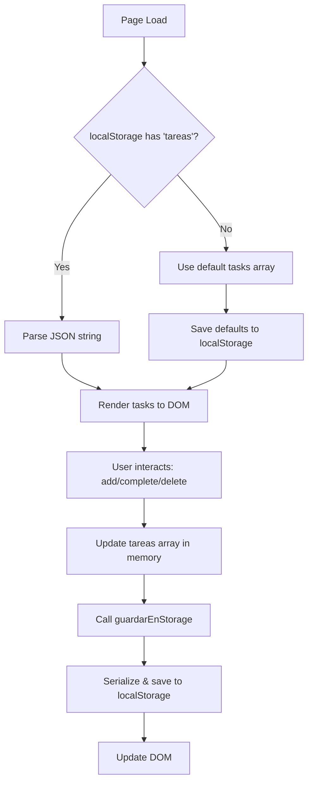

## Overview

Taskflow uses the browser's **localStorage API** to persist tasks between sessions. All data is stored client-side as JSON-stringified arrays with no backend server required.

<Warning>
**Browser-Specific Storage**: localStorage data is stored per-origin in each browser. Tasks are NOT synced across:
- Different browsers (Chrome vs Firefox)
- Different devices (desktop vs mobile)
- Incognito/private browsing sessions
</Warning>

## Storage Architecture

### Key-Value Structure

Taskflow stores two pieces of data in localStorage:

| Key | Value Type | Purpose |
|-----|------------|--------|
| `tareas` | JSON string (array) | All task objects |
| `tema` | String (`'dark'` or `'light'`) | User's theme preference |

### Task Data Format

Each task is stored as a JavaScript object within the `tareas` array:

```javascript Task Object Structure
{
  id: 1234567890123,          // Unique timestamp ID
  texto: 'Hacer ejercicio',   // Task description
  categoria: 'Personal',      // Category label
  prioridad: 'alta',          // 'alta', 'media', or 'baja'
  completada: false           // Boolean completion status
}
```

The entire tasks array is serialized to JSON:

```json localStorage['tareas'] Example
[
  {
    "id": 1,
    "texto": "Hacer ejercicio",
    "categoria": "Personal",
    "prioridad": "alta",
    "completada": false
  },
  {
    "id": 2,
    "texto": "Estudiar",
    "categoria": "Estudios",
    "prioridad": "alta",
    "completada": true
  },
  {
    "id": 3,
    "texto": "Revisar gastos",
    "categoria": "Personal",
    "prioridad": "media",
    "completada": false
  }
]
```

## Core Storage Functions

### guardarEnStorage()

Saves the current `tareas` array to localStorage:

```javascript app.js:12-14
function guardarEnStorage() {
    localStorage.setItem('tareas', JSON.stringify(tareas));
}
```

<Accordion title="How it works">
1. **Serialization**: `JSON.stringify()` converts the JavaScript array to a JSON string
2. **Storage**: `localStorage.setItem()` saves the string with the key `'tareas'`
3. **Persistence**: Data survives browser restarts and page refreshes
</Accordion>

#### When is it called?

Every time tasks are modified:

- ✅ **Adding a task** (app.js:65)
- ✅ **Completing/uncompleting a task** (app.js:44)
- ✅ **Deleting a task** (app.js:49)
- ✅ **First load with default data** (app.js:127)

### cargarTareas()

Loads tasks from localStorage or seeds default data on first run:

```javascript app.js:117-136
function cargarTareas() {
    const guardadas = localStorage.getItem('tareas');

    tareas = guardadas ? JSON.parse(guardadas) : [
        { id: 1, texto: 'Hacer ejercicio',  categoria: 'Personal',    prioridad: 'alta',  completada: false },
        { id: 2, texto: 'Estudiar',          categoria: 'Estudios',    prioridad: 'alta',  completada: false },
        { id: 3, texto: 'Revisar gastos',    categoria: 'Personal',    prioridad: 'media', completada: false },
        { id: 4, texto: 'Jugar videojuegos', categoria: 'Videojuegos', prioridad: 'baja',  completada: false }
    ];

    if (!guardadas) guardarEnStorage();

    tareas.forEach(function(t) {
        document.getElementById('seccion-' + t.prioridad).appendChild(crearTareaElemento(t));
    });

    actualizarContadores();
}
```

<Steps>
  <Step title="Retrieve stored data">
    `localStorage.getItem('tareas')` returns the JSON string or `null` if not found
  </Step>
  
  <Step title="Parse or use defaults">
    - If data exists: `JSON.parse(guardadas)` deserializes the string back to an array
    - If no data: Use the hardcoded default tasks array
  </Step>
  
  <Step title="Save defaults if needed">
    If this is the first load (`!guardadas`), save the default tasks to localStorage
  </Step>
  
  <Step title="Render tasks to DOM">
    Loop through each task and append it to the appropriate priority section
  </Step>
  
  <Step title="Update counters">
    Refresh the task count display in section headers
  </Step>
</Steps>

### Theme Persistence

The user's theme preference is also stored in localStorage:

```javascript app.js:104-114
function aplicarTema(oscuro) {
    document.documentElement.classList.toggle('dark', oscuro);
    btnTema.textContent = oscuro ? '🌙' : '☀️';
    localStorage.setItem('tema', oscuro ? 'dark' : 'light');
}

// Apply saved theme on page load
aplicarTema(localStorage.getItem('tema') === 'dark');

btnTema.addEventListener('click', function() {
    aplicarTema(!document.documentElement.classList.contains('dark'));
});
```

<Info>
**Initialization**: On page load (line 110), the app checks `localStorage.getItem('tema')` and applies the saved preference immediately before tasks render.
</Info>

## Default Data Seeding

When a user visits the app for the first time (no `tareas` key in localStorage), four default tasks are created:

```javascript Default Tasks
[
    { 
        id: 1, 
        texto: 'Hacer ejercicio',  
        categoria: 'Personal',    
        prioridad: 'alta',  
        completada: false 
    },
    { 
        id: 2, 
        texto: 'Estudiar',          
        categoria: 'Estudios',    
        prioridad: 'alta',  
        completada: false 
    },
    { 
        id: 3, 
        texto: 'Revisar gastos',    
        categoria: 'Personal',    
        prioridad: 'media', 
        completada: false 
    },
    { 
        id: 4, 
        texto: 'Jugar videojuegos', 
        categoria: 'Videojuegos', 
        prioridad: 'baja',  
        completada: false 
    }
]
```

These defaults:
- Demonstrate the app's functionality immediately
- Show examples of different priorities and categories
- Are saved to localStorage on first load (app.js:127)

## Storage Workflow



## ID Generation

New tasks use timestamps for unique IDs:

```javascript app.js:63
const t = { 
    id: Date.now(), // Current timestamp in milliseconds
    texto, 
    categoria, 
    prioridad: selectPrioridad.value, 
    completada: false 
};
```

<Tip>
**Why timestamps?** 
- Guaranteed uniqueness (millisecond precision)
- No need for counter management
- Chronological ordering by default
</Tip>

## Storage Limits & Considerations

<AccordionGroup>
  <Accordion title="Storage Capacity">
    - **Typical limit**: 5-10 MB per origin across all localStorage keys
    - **Taskflow usage**: Even 1,000 tasks would be ~100KB (well within limits)
    - **No warning**: Browser silently fails if quota exceeded
  </Accordion>
  
  <Accordion title="Performance">
    - **Synchronous API**: `localStorage.getItem()` and `setItem()` block the main thread
    - **Impact**: Negligible for small datasets like task lists
    - **Alternative**: IndexedDB for larger datasets (not needed here)
  </Accordion>
  
  <Accordion title="Security">
    - **No encryption**: Data stored as plain text
    - **Same-origin policy**: Only accessible by the same domain/protocol/port
    - **Not for sensitive data**: Avoid storing passwords, tokens, or PII
  </Accordion>
  
  <Accordion title="Data Integrity">
    - **No validation**: App doesn't validate JSON structure on load
    - **Manual corruption**: Users can edit localStorage via DevTools
    - **Potential improvement**: Add try-catch around `JSON.parse()`
  </Accordion>
</AccordionGroup>

## Debugging Storage

### View localStorage in DevTools

<Steps>
  <Step title="Open DevTools">
    Press `F12` or right-click → Inspect
  </Step>
  
  <Step title="Navigate to Application tab">
    (Chrome/Edge) or Storage tab (Firefox)
  </Step>
  
  <Step title="Expand Local Storage">
    Find your domain (e.g., `http://localhost:3000`)
  </Step>
  
  <Step title="View/Edit keys">
    - Click `tareas` to see the JSON string
    - Click `tema` to see `'dark'` or `'light'`
    - Right-click to delete or modify values
  </Step>
</Steps>

### Console Commands

```javascript View all tasks in console
JSON.parse(localStorage.getItem('tareas'))
```

```javascript Clear all tasks
localStorage.removeItem('tareas')
location.reload()
```

```javascript Reset to defaults
localStorage.clear()
location.reload()
```

## localStorage vs Alternatives

<CardGroup cols={2}>
  <Card title="✅ localStorage (Current)" icon="database">
    **Pros**:
    - Simple API
    - Synchronous (no async complexity)
    - Persistent across sessions
    - Perfect for small datasets
    
    **Cons**:
    - Not synced across devices
    - String-only storage
    - Size limits (5-10MB)
  </Card>
  
  <Card title="sessionStorage" icon="clock">
    **Pros**:
    - Same API as localStorage
    - Per-tab isolation
    
    **Cons**:
    - **Data lost on tab close** ❌
    - Not suitable for Taskflow
  </Card>
  
  <Card title="IndexedDB" icon="server">
    **Pros**:
    - Much larger storage
    - Structured data (objects, indexes)
    - Async (non-blocking)
    
    **Cons**:
    - **More complex API** ❌
    - Overkill for simple task lists
  </Card>
  
  <Card title="Backend Database" icon="cloud">
    **Pros**:
    - Cross-device sync
    - Backup/restore capabilities
    - User authentication
    
    **Cons**:
    - **Requires server infrastructure** ❌
    - Network dependency
    - More complex architecture
  </Card>
</CardGroup>

<Check>
**Verdict**: localStorage is the ideal choice for Taskflow's requirements - simple, persistent, and sufficient for local task management.
</Check>
